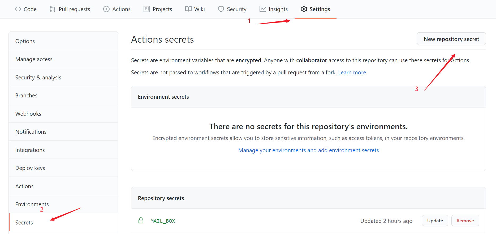
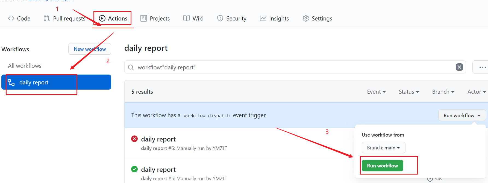
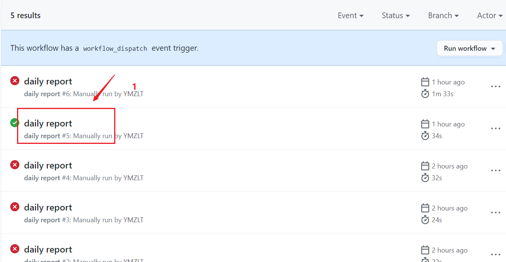
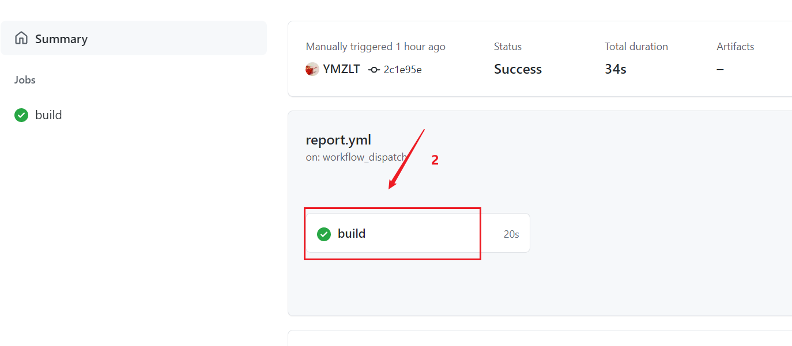
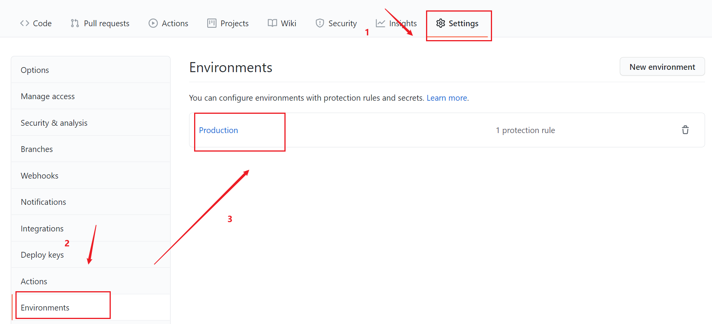
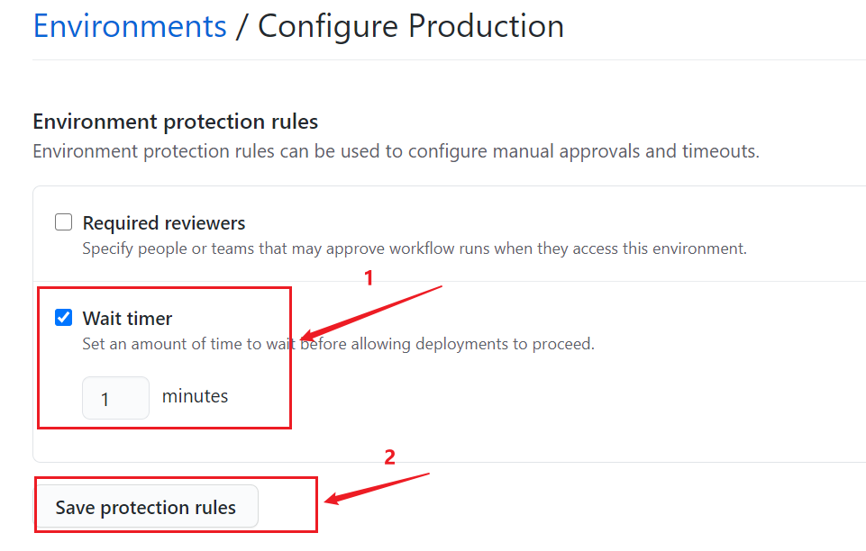
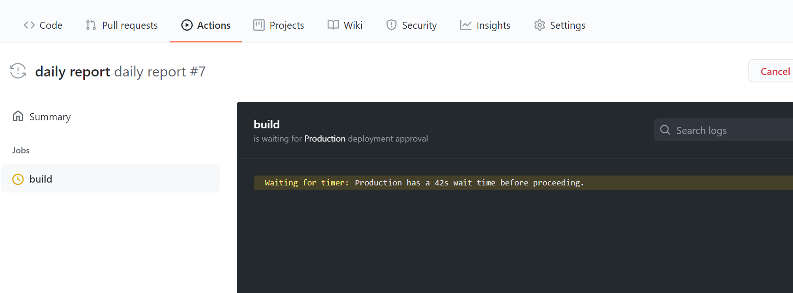

# SHU_dailyReport

# 项目简介

  该项目基于python的request库和bs4库实现上海大学每日一报的自动报送。
  report.py 用于进行当日报送，可部署于服务器或者GitHub Action来实现每天自动报送。
  delayReport.py 用于一次性补报之前日期，clone到本地直接运行即可。


# 本地报送和补报

1. 把代码clone到本地

   ```
   git clone https://github.com/YMZLT/dailyReport.git
   ```
2. 安装依赖的两个python库:request和bs4
3. 运行delayReport.py补报
   ```python
   python report.py 学号 密码 补报天数
   ```
4. 或者report.py进行当日报送
   ```python
   python report.py 学号 密码
   ```

# GitHub Action自动报送

## 准备工作（可选）

    一个163邮箱账号：用于发送报送成功的邮件

##	上手教程

### 1、把代码fork到你的仓库

### 2、邮箱配置（可选）

  github action 实现自动发邮件需要一个配置SMTP服务的邮箱。以配置163邮箱为例，先登录邮箱，点击设置，选择POP3/SMTP/IMAP,然后开启SMTP服务。
 
  开启服务后会生成一个专用密码，将该密码记录下来，用于下面的Secrets配置。

### 3、Secrets 配置
进入自己 fork 的仓库，点击 Settings-> Secrets-> New Secrets， 添加 1 个 Secrets，其名称为`STUDENTID`，值为自己的学号。它们将作为配置项，在应用启动时传入程序。然后再添加一个Secrets，`STUDENTID`值为自己的密码。


如果需要发送邮件的话还需要配置下面三个 Secrets：

  - MAIL_USERNAME 自动发邮件的邮箱号
  - MAIL_PASSWORD 自动发邮件的邮箱密码
  - MAIL_BOX 接受邮件的邮箱号

### 4、手动运行工作流
都配置好后，请手动开启 Actions，执行一次工作流，验证是否可以正常工作，操作步骤如下图所示：



运行结束后，可查看运行日志：




Actions 的执行策略默认是每天0点和16点整触发运行，如果想要设置自己的运行时间，请详见下面**常见问题**

### 5、运行结束后，会有邮件发送


## 常见问题

### 1、不想接收邮件

不想接收邮件的话，删除.github/workflows/report.yml中下面的部分代码，同时在secrets中不配置邮箱账号和密码。
```
# 获取格式化的日期并存入GitHub内置的环境变量中
      - name: 'Get Date'
        run: echo "REPORT_DATE=$(TZ=':Asia/Shanghai' date '+%Y-%m-%d %T')" >> $GITHUB_ENV
      
      # 发送邮件
      - name: 'Send mail'
        uses: dawidd6/action-send-mail@master
        with:
          # 这些是发送邮件需要配置的参数，更多详细的说明请访问具体的仓库
          server_address: smtp.163.com
          server_port: 465
          # 这些secret的环境变量需要配置在setting中的secret下
          username: ${{ secrets.MAIL_USERNAME }}
          password: ${{ secrets.MAIL_PASSWORD }}
          subject: 每日一报 (${{env.REPORT_DATE}})
          body: file://mail.html
          to: ${{ secrets.MAIL_BOX }}
          from: GitHub Actions
          content_type: text/html
```
### 2、修改运行时间report
每日任务执行的时间，由.github/workflows/report.yml 中的cron表达式指定，默认为每日的0点整和16点:

```yml
schedule: # 定时触发
    # cron表达式，时区是UTC时间，比我们早8小时，如下所表示的是16表示的是每天0点0分
    - cron: '0,0 16,8 * * *'
```

**若要修改为自己指定的时间执行，有如下两种方式：**

- 方法一：修改yaml文件中的cron表达式
  我们可以直接修改上述该文件中的cron表达式，然后提交。

个人不建议这么做，因为以后更新要注意冲突与覆盖问题，建议使用下面的方法二。

- 方法二：添加 GitHub Environments 并设置延时
  v1.1.3及之后版本，支持通过添加GitHub Environments来设置延时运行，即在每日0点整触发 Actions 后，会再多执行一个延时操作，延时时长可由我们自己设置。

  比如想设置为每天8点执行，只需要将这个延时时常设置为480分钟（8个小时）即可。方法如下：

  - Ⅰ. 找到 Production Environments
    		运行完 report.yml 之后，在 Settings ——> Environments 中会自动多出一个名为 Production 的环境，如下图所示：
    
  - Ⅱ.设置延时时长
    勾选 Wait timer，并填写延时时长，单位为分钟，如下图所示：
    

  设置成功后，再次运行 Actions 会发现触发后会自动进入倒计时状态，等倒计时结束(这里我设置的是1分钟)后才会真正运行之后的内容，如下图所示：
  

### 3、停止运行

之后要是不需要每天填报了，那进入setting->action->选择Disable Actions for this repository。该仓库的工作流将不再运行。

## 参考链接

[GitHub Actions 入门教程](http://www.ruanyifeng.com/blog/2019/09/getting-started-with-github-actions.html)

[BiliBiliTool](https://github.com/RayWangQvQ/BiliBiliTool)

[GitHub Actions 教程：定时发送天气邮件](http://www.ruanyifeng.com/blog/2019/12/github_actions.html)

[Python实现自动签到脚本](https://blog.csdn.net/ydydyd00/article/details/80882183)

[手动触发 GitHub Actions 的几种方式](https://p3terx.com/archives/github-actions-manual-trigger.html)


